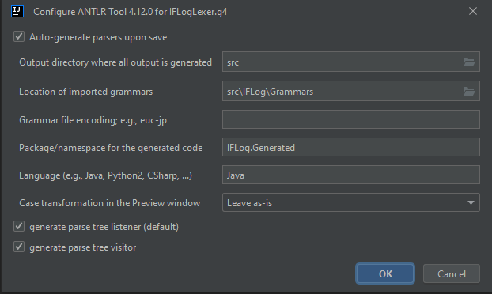

# IFLog [](./LICENSE)

A declarative programming language for Textadventure-Games (also known as Interactive Fiction),
inspired by the deductive language Datalog, which in itself is a syntactic subset of Prolog.

The purpose of IFLog is to allow developers to write Interactive Fiction applications in a simple declarative language and then translate them in a multitude of different SQL dialects. The resulting scripts can then be used to setup a database and allow students to practice SQL by playing the game using SQL queries. The developer should only ever need to setup the specification of a SQL target dialect once and then be able to reuse it for various applications. 

# Disclaimer
This project is a proof of concept of the IFLog programming language proposed in the master thesis "IFLog: Ein deklarativer Ansatz für den Einsatz regelbasierter Systeme in Spieleentwicklung und Lehre" by John-Dean Mochow. The title of the thesis can be loosely translated as "IFLog: A declarative approach for the employment of rule-based systems in game development and education".

As such it is in no shape or form feature-complete or bug-free. Hence it should mostly be used as a starting point or as a reference if one wants to implement a translator or compiler based on IFLog or a similar language. 

# Current Version (Development and Testing)

The current version of IFLog (i.e. the one you are currently viewing)
was developed, compiled and tested on Windows 10 Home, 64-Bit, Version 22H2.
Additionally the following software (in their respective version) were used:
- IntelliJ Community Edition 2023.1
- OpenJDK 19.0.2
- ANTLR 4.12.0
- PostgreSQL 15.2.2

# Contents

## IFLog

This directory contains the actual source code, as well as an IntelliJ-Project
which can be used to easily extend or compile IFLog.
The core files are located under [src/IFLog](./IFLog/src/IFLog).
The Java output should be generated into [out](./IFLog/out).
The JARs for any third party library should be added under [vendor](./IFLog/vendor).  

The project uses the 3rd-party library [picocli](https://picocli.info/) for the processing of
command line arguments. The full source is included in the file [src/CommandLine.java](./IFLog/src/CommandLine.java).

Additionally IFLog uses [ANTLR](https://www.antlr.org/) for the lexing and parsing.

[src/Main.java](./IFLog/src/Main.java) demonstrates how to use IFLog inside a Java project.

### General Project Structure (of [IFLog/src/IFLog](./IFLog/src/IFLog))
---

[IFLog.java](./IFLog/src/IFLog/IFLog.java) creates a number of instances of the main components.

The [ANTLR-Grammars](./IFLog/src/IFLog/Grammars) create the parsers and lexers which are contained inside the [Generated directory](./IFLog/src/IFLog/Generated).

An application written in IFLog gets parsed using the so generated parser and lexer files, afterwards there's a sort-of post-parsing step using the [extractors](./IFLog/src/IFLog/Extractors).
The  [evaluators](./IFLog/src/IFLog/Evaluators) then do some additional checks to ensure that certain language constraints aren't violated. Lastly the actual output gets generated using the [translators](./IFLog/src/IFLog/Translators) which make use of a translation map that was previously created using the provided target specification.

[Components](./IFLog/src/IFLog/Components) basically define custom data structures for the various major language constructs (like tables or views). Each component has an associated extractor, evaluator and translator. 

[Core](./IFLog/src/IFLog/Core) contains the main files of the application. [Extractor.java](./IFLog/src/IFLog/Core/Extractor.java), [Evaluator.java](./IFLog/src/IFLog/Core/Evaluator.java) and [Translator.java](./IFLog/src/IFLog/Core/Translator.java) basically just run their respective step for each component one after another. [Assert.java](./IFLog/src/IFLog/Core/Assert.java) contains custom asserts that get used throughout the project to avoid additional dependencies. Likewise [FileIO.java](./IFLog/src/IFLog/Core/FileIO.java) and [Logger.java](./IFLog/src/IFLog/Core/Logger.java) are used for reading and writing to files, as well as console output respectively. The custom asserts also makes use of the logger. [Globals.java](./IFLog/src/IFLog/Core/Globals.java) contains any global variables.    

### How to compile IFLog from source?
---

First one needs to add the desired ANTLR version to the [vendor directory](./IFLog/vendor)
and link it to the Java project (e.g. inside IntelliJ).

Afterwards one needs to compile the Grammars located under [src/IFLog/Grammars](./IFLog/src/IFLog/Grammars)
into [src/IFLog/Generated](./IFLog/src/IFLog/Generated) using ANTLR (there are plugins for a number of common IDEs).
Refer to the following configuration that was used in IntelliJ:



Now we can compile the actual project using [src/Main.java](./IFLog/src/Main.java) as the entry point.
Additionally we could also simply create an instance of [src/IFLog/IFLog.java](./IFLog/src/IFLog/IFLog.java)
and setup our own parser inside of Java:
```
// create an instance of the IFLog-Parser
IFLog myAppInstance = new IFLog();

// parse and translate the input file using the sql target definition
myAppInstance.Run("myInputFile.ifl", "mySQLTarget.ifltarget");

// generate the output file
String outputFile = myAppInstance.GenerateOutput();

// clear the output file of any previous content
FileIO.Flush("myOutputFile.sql");

// write to the output file
FileIO.Write(outputFile, "myOutputFile.sql");
```

## demo

This is a simple demo project that was developed as part of the presentation.
At the moment there's an [english](./demo/en) and [german](./demo/de) version, as well as a small [Textadventure-Parser](./demo/run-en.py) written in Python. The latter one compiles the IFLog-Code into PostgreSQL and then uses the generated code to setup a database. We can then run
a number of Textadventure-Commands to play the game. Additionally each command outputs
the PostgreSQL query that was run, as well as their result. In practice the player is
supposed to only use said queries to play the game and in turn practice how to use SQL.

The [german version](./demo/run-de.py) of the Python file also contains some additional setup
which is required for Windows to properly display mutated vowels like ä, ü or ö. 

For the the Python program to run properly, one likely needs to change some of the constants at the top.
The following three lines should be changed (in order) to the password that is required to run the psql command, the name of the database that should be created (might be left as is) and the prefix that PostgreSQL uses when it outputs a NOTICE.
```
NEW_ENV["PGPASSWORD"]   = "postgres"
DB_NAME                 = "iflogdemodb"
DB_NOTICE_PREFIX        = "HINWEIS:"
```

### How to play? (using the english version)
---

First we need to start the Python program:
```
cd demo
py run-en.py
```

We can then use a number of commands that basically run IFLog.jar:
```
h | help
t | test
o | out
l | log
```

So if we want to get the help dialog from IFLog.jar we simply use "h" or "help".
Likewise we can use "test" to check if the syntax is valid and "out" to create the desired
SQL ouput file. "log" does the same as "out" but also generates a log file.

After generating the output file we can setup the database:
```
i | init
``` 

Similarly we can drop and reset the database:
```
d | destroy
r | reinit
``` 

We can then start the game or exit the program:
```
s | start
q | quit | exit
```

Inside the game (after using "start") we can move up, down, right and left respectively:
```
n | north | go north
s | south | go south
e | east  | go east
w | west  | go west
```

We can open the inventory and show the map (with the current player location):
```
i | inv | inventory
m | map
```

We can check for any secrets at the current location and also try to interact with the environment:
```
x | examine
a | d | do | do action
```

Obviously we can also end the game:
```
q | quit | exit
```

The following sequence of commands is the shortest path to win the game:
```
west
do

east

north
do
```

The following sequence of commands is the shortest path to lose the game:
```
north
do
```

The following sequence of commands is more closely aligned with how an actual player would interact with the game:
```
inv
map
examine
do

north
map
examine
south

west
map
examine
do
inventory
examine
do

east

north
examine
do
```

We can simply exit and recreate the database to start a new playthrough:
```
quit
reinit
start
```

## lib

These are the compiled jar-Files for ease of use.
The directory [Module](./lib/Module) contains a jar-File that can be linked inside another Java-Project.
The directory [Standalone](./lib/Standalone) contains a jar-File that can used from the command line (as demonstrated in the demo directory).
For further information simply refer to the demo or call the Standalone-Jar using one of the
following commands:
```
java -jar IFLog.jar -h
java -jar IFLog.jar --help
```

## syntax-highlighting

This directory should contain all available syntax highlighting configurations for various IDEs and text editors.

At the moment there's only a simple (incomplete) example for the Sublime Texteditor, using the Mariana Color Scheme which can be used as a starting point.

## target

This directory should contain all available target definitions.
In other words the specifications of the target SQL-dialect which the application written in IFLog is supposed to be translated into.

At the moment there's only a specification for PostgreSQL.
